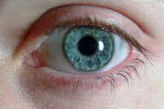
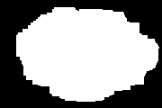
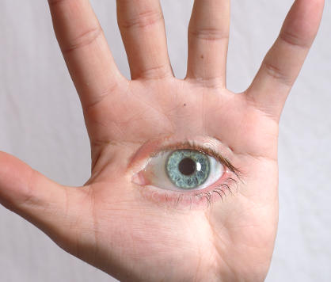
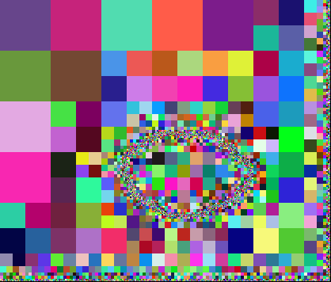
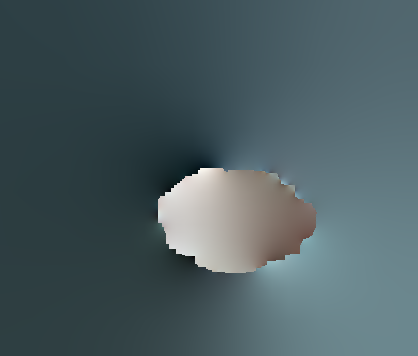

# Image Composition

The homework of "Media Computing" of Tsinghua University, Fall 2019.

A C++ implementation of the following paper:

Agarwala, Aseem. "Efficient gradient-domain compositing using quadtrees." _ACM Transactions on Graphics (TOG)._ Vol. 26. No. 3. ACM, 2007.

## Usage

You can simply use the following command to compile this project
```bash
g++ *.cpp -o composite -O2
```

And then run by
```bash
./composite <directory>
```
You need to put your images and their masks into `<directory>`, and you also need to create a configuration file `layers.conf` on `<directory>`. The configuration file contains multiple lines, each of which has 4 components separated by whitespace describing an image and its mask:
```
<image path> <mask path> <offset_x> <offset_y>
```

An example can be found in `images/hand-eye`.

## Example

For example, if you want to composite the following two images:




The configuration `layers.conf` is:

```plain
test2_target.png NULL 0 0
test2_src.png test2_mask.png 160 140
```

The result image is



and the corresponding quadtree and delta map are



## Reference

[1] https://github.com/llylly/ImageCompositing

[2] http://www.agarwala.org/efficient_gdc/

[3] Agarwala, Aseem. "Efficient gradient-domain compositing using quadtrees." _ACM Transactions on Graphics (TOG)._ Vol. 26. No. 3. ACM, 2007.

